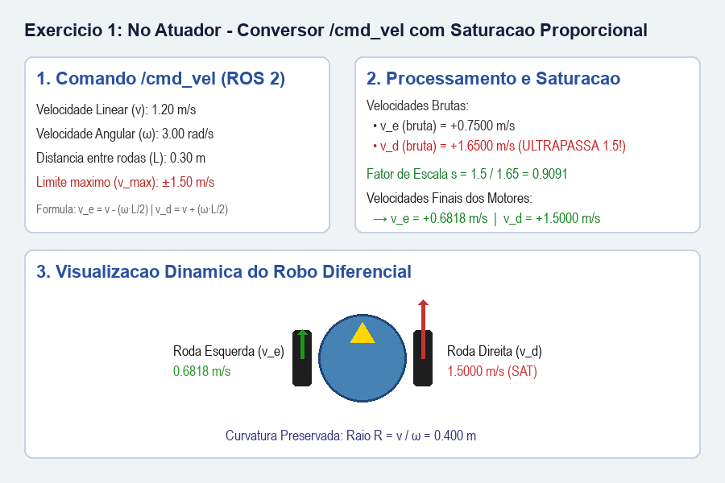
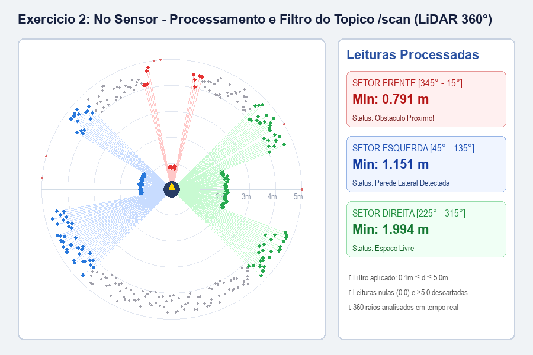
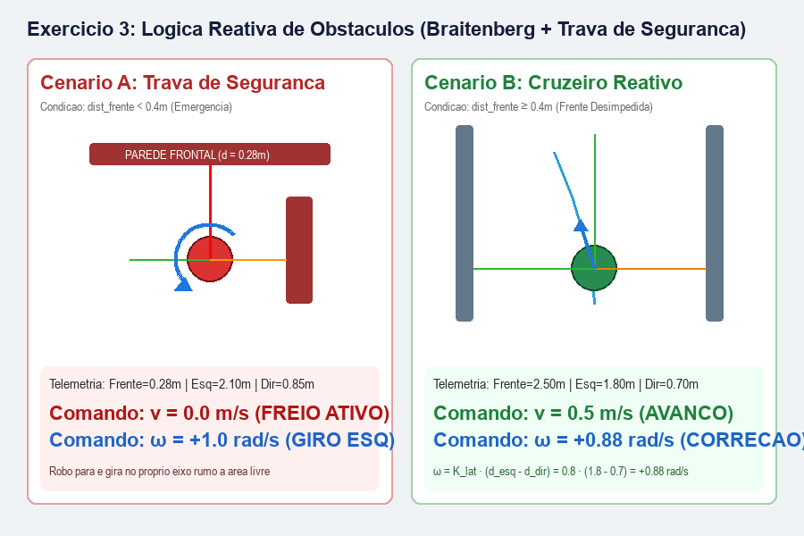
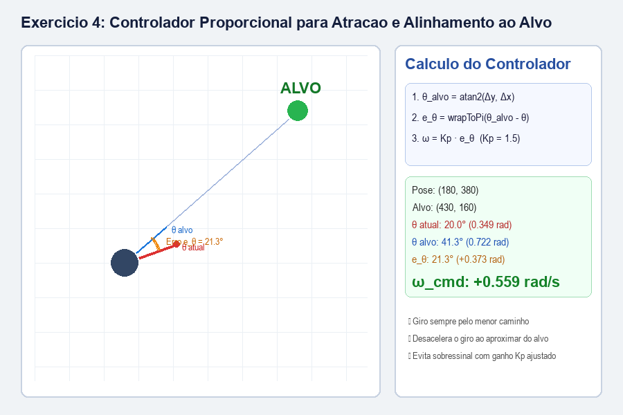
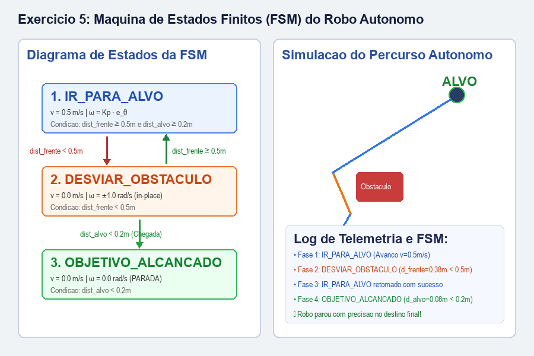

# AULA 05 — LABORATÓRIOS
## AC-2 — Parte Final: Arquitetura ROS 2, Sensoriamento LiDAR, Controle Reativo, Atração ao Alvo e Máquina de Estados (FSM)

Nesta aula foram desenvolvidos os cinco exercícios práticos que integram os conceitos fundamentais de robótica móvel aos padrões de arquitetura do **ROS 2** (Robot Operating System), cobrindo nós atuadores, nós de sensoriamento (/scan 360°), lógica reativa de emergência, controle proporcional de malha fechada e máquinas de estados finitos (FSM).

---

## 1. Fundamentação Teórica e Contexto ROS 2

1. **Middleware ROS 2:** O robô é modularizado em nós independentes que se comunicam através de mensagens padronizadas em tópicos:
   - `/cmd_vel` (`geometry_msgs/msg/Twist`): Comandos de velocidade linear $v$ (m/s) e angular $\omega$ (rad/s).
   - `/scan` (`sensor_msgs/msg/LaserScan`): Leituras de distância do sensor LiDAR em 360°.
2. **Simulação 3D no Gazebo:** Simula a física real (massa, atrito, inércia) a partir do modelo virtual (URDF) do robô.
3. **SLAM & Nav2:** Mapeamento simultâneo com LiDAR e navegação autônoma em malha fechada com planejador global e local.

---

## Exercício 1 — Nó Atuador: Conversor de `/cmd_vel` com Saturação dos Motores

### Objetivo
Receber os comandos $(v, \omega)$ do planejador no tópico `/cmd_vel`, calcular as velocidades individuais de cada roda $(v_e, v_d)$ para um robô diferencial com bitola $L = 0.3\text{ m}$ e aplicar **saturação proporcional** caso a velocidade exceda o limite físico dos motores de $\pm 1.5\text{ m/s}$.

### Formulação Matemática
1. **Cinemática Diferencial Inversa:**
   $$v_e = v - \frac{\omega \cdot L}{2}$$
   $$v_d = v + \frac{\omega \cdot L}{2}$$
2. **Saturação Proporcional (Preservação de Curvatura):**
   $$s = \frac{v_{max}}{\max(|v_e|, |v_d|)} \quad (\text{se } \max(|v_e|, |v_d|) > v_{max})$$
   $$v_e \leftarrow v_e \cdot s, \quad v_d \leftarrow v_d \cdot s$$

### Código Implementado
```python
def converter_cmd_vel(v, omega, L=0.3, max_wheel_speed=1.5):
    # 1. Velocidades brutas
    v_e_raw = v - (omega * L / 2.0)
    v_d_raw = v + (omega * L / 2.0)
    
    # 2. Verificação do limite máximo
    max_raw = max(abs(v_e_raw), abs(v_d_raw))
    
    # 3. Saturação proporcional
    if max_raw > max_wheel_speed:
        escala = max_wheel_speed / max_raw
        v_e = v_e_raw * escala
        v_d = v_d_raw * escala
    else:
        v_e = v_e_raw
        v_d = v_d_raw
        
    return v_e, v_d
```

### Resultados Obtidos
- **Teste com comando $(v=1.2\text{ m/s}, \omega=3.0\text{ rad/s})$:**
  - $v_{e,\text{bruto}} = 1.2 - \frac{3.0 \times 0.3}{2} = +0.7500\text{ m/s}$
  - $v_{d,\text{bruto}} = 1.2 + \frac{3.0 \times 0.3}{2} = +1.6500\text{ m/s}$ *(ultrapassa o limite de 1.5 m/s)*
  - Fator de escala: $s = \frac{1.5}{1.65} \approx 0.9091$
  - Velocidades finais: $v_e = +0.6818\text{ m/s}$, $v_d = +1.5000\text{ m/s}$



---

## Exercício 2 — Nó Sensor: Processador e Filtro do Tópico `/scan`

### Objetivo
Processar um array completo de 360 feixes do sensor LiDAR, descartando leituras com ruídos espúrios ($d < 0.1\text{ m}$) e medições fora de alcance ($d > 5.0\text{ m}$ ou reflexões nulas $0.0$). A função divide o campo de visão em 3 setores essenciais e retorna a menor distância de cada setor.

### Setores Analisados
- **Frente:** $345^\circ$ a $359^\circ$ e $0^\circ$ a $15^\circ$ (campo frontal de $30^\circ$)
- **Esquerda:** $45^\circ$ a $135^\circ$ (campo lateral esquerdo de $90^\circ$)
- **Direita:** $225^\circ$ a $315^\circ$ (campo lateral direito de $90^\circ$)

### Código Implementado
```python
import numpy as np

def processar_scan(leituras_lidar):
    leituras = np.array(leituras_lidar, dtype=float)
    
    indices_frente = np.concatenate([np.arange(345, 360), np.arange(0, 16)])
    indices_esq = np.arange(45, 136)
    indices_dir = np.arange(225, 316)
    
    def extrair_min_valido(indices, default_val=5.0):
        valores = leituras[indices]
        validos = valores[(valores >= 0.1) & (valores <= 5.0)]
        if len(validos) > 0:
            return float(np.min(validos))
        return float(default_val)
    
    return {
        'frente': round(extrair_min_valido(indices_frente), 4),
        'esquerda': round(extrair_min_valido(indices_esq), 4),
        'direita': round(extrair_min_valido(indices_dir), 4)
    }
```

### Resultados Obtidos
```text
Processamento dos dados de 360 graus do LiDAR:
  Total de feixes analisados: 360
  Menor distancia Frente (345° a 15°)  : 0.791 m
  Menor distancia Esquerda (45° a 135°): 1.151 m
  Menor distancia Direita (225° a 315°): 1.994 m

Dicionario retornado:
  {'frente': 0.7914, 'esquerda': 1.1514, 'direita': 1.9938}
```



---

## Exercício 3 — Lógica Reativa de Obstáculos (Braitenberg com Trava de Segurança)

### Objetivo
Desenvolver a tomada de decisão reativa baseada nas distâncias dos 3 setores do LiDAR. Se houver risco iminente de colisão frontal ($d_{frente} < 0.4\text{ m}$), o robô aciona o freio ($v = 0.0\text{ m/s}$) e executa rotação sobre o próprio eixo ($\omega = \pm 1.0\text{ rad/s}$) em direção ao setor com maior folga. Se a frente estiver desimpedida, mantém cruzeiro a $v = 0.5\text{ m/s}$ com ajuste proporcional nas laterais.

### Código Implementado
```python
def controle_reativo(distancias, K_lat=0.8, dist_critica=0.4):
    dist_frente = distancias.get('frente', 5.0)
    dist_esq = distancias.get('esquerda', 5.0)
    dist_dir = distancias.get('direita', 5.0)
    
    if dist_frente < dist_critica:
        v = 0.0
        omega = 1.0 if dist_esq >= dist_dir else -1.0
    else:
        v = 0.5
        omega = K_lat * (dist_esq - dist_dir)
        omega = max(-1.5, min(1.5, omega))
        
    return v, omega
```

### Resultados Observados
- **Bloqueio Crítico Frontal ($d_f = 0.25\text{ m}$, $d_e = 2.10\text{ m}$, $d_d = 0.80\text{ m}$):**
  - Trava de segurança ativada: $v = 0.00\text{ m/s}$, $\omega = +1.00\text{ rad/s}$ (giro no próprio eixo para a esquerda).
- **Cruzeiro em Corredor ($d_f = 2.50\text{ m}$, $d_e = 1.80\text{ m}$, $d_d = 0.70\text{ m}$):**
  - Avanço nominal: $v = 0.50\text{ m/s}$, $\omega = +1.20\text{ rad/s}$ (afastamento suave da parede direita).



---

## Exercício 4 — Controlador Proporcional para Atração ao Alvo

### Objetivo
Orientar o robô em malha fechada rumo a uma coordenada alvo $(x_{alvo}, y_{alvo})$ a partir da sua pose atual $(x, y, \theta)$, calculando o erro angular com tratamento de descontinuidade no intervalo $[-\pi, \pi]$ e aplicando controle proporcional com ganho $K_p = 1.5$.

### Formulação Matemática
1. **Ângulo Desejado:**
   $$\theta_{alvo} = \text{atan2}(y_{alvo} - y, \, x_{alvo} - x)$$
2. **Erro Angular Normalizado:**
   $$e_\theta = \text{atan2}(\sin(\theta_{alvo} - \theta), \, \cos(\theta_{alvo} - \theta)) \in [-\pi, \pi]$$
3. **Lei de Controle Proporcional:**
   $$\omega = K_p \cdot e_\theta \quad (K_p = 1.5)$$

### Código Implementado
```python
import math

def calcular_orientacao_alvo(x, y, theta, x_alvo, y_alvo, Kp=1.5):
    theta_alvo = math.atan2(y_alvo - y, x_alvo - x)
    e_theta = math.atan2(math.sin(theta_alvo - theta), math.cos(theta_alvo - theta))
    omega = Kp * e_theta
    return omega
```

### Resultados Obtidos
- **Alvo no 1º quadrante $(2.0, 2.0)$ com pose $(0.0, 0.0, \theta=0.0\text{ rad})$:**
  - $\theta_{alvo} = 45.0^\circ$ ($0.7854\text{ rad}$)
  - $e_\theta = +0.7854\text{ rad}$
  - $\omega = 1.5 \times 0.7854 = +1.1781\text{ rad/s}$
- **Alvo no 2º quadrante $(-1.0, 3.0)$ com pose $(1.0, 1.0, \theta=0.0\text{ rad})$:**
  - $\theta_{alvo} = 135.0^\circ$ ($2.3562\text{ rad}$)
  - $\omega = 1.5 \times 2.3562 = +3.5343\text{ rad/s}$



---

## Exercício 5 — Máquina de Estados Finitos (FSM) do Robô Autônomo

### Objetivo
Integrar os módulos de sensoriamento, controle reativo e atração ao alvo através de uma Máquina de Estados Finitos (FSM) com 3 estados operacionais:
1. `IR_PARA_ALVO`: Avança ($v = 0.5\text{ m/s}$) e orienta $\omega$ proporcionalmente ao erro em direção ao alvo.
2. `DESVIAR_OBSTACULO`: Ativado quando a distância frontal for menor que $0.5\text{ m}$ ($v = 0.0\text{ m/s}$, $\omega = \pm 1.0\text{ rad/s}$).
3. `OBJETIVO_ALCANÇADO`: Ativado quando a distância euclidiana até o alvo for menor que $0.2\text{ m}$ ($v = 0.0\text{ m/s}$, $\omega = 0.0\text{ rad/s}$).

### Código Implementado
```python
import math

def maquina_de_estados(x, y, theta, x_alvo, y_alvo, dist_frente, dist_esq, dist_dir):
    dist_alvo = math.sqrt((x_alvo - x)**2 + (y_alvo - y)**2)
    
    if dist_alvo < 0.2:
        estado_atual = "OBJETIVO_ALCANCADO"
        v_cmd = 0.0
        omega_cmd = 0.0
    elif dist_frente < 0.5:
        estado_atual = "DESVIAR_OBSTACULO"
        v_cmd = 0.0
        omega_cmd = 1.0 if dist_esq >= dist_dir else -1.0
    else:
        estado_atual = "IR_PARA_ALVO"
        v_cmd = 0.5
        omega_cmd = calcular_orientacao_alvo(x, y, theta, x_alvo, y_alvo, Kp=1.5)
        omega_cmd = max(-2.0, min(2.0, omega_cmd))
        
    return estado_atual, v_cmd, omega_cmd
```

### Validação das Transições da FSM
- **Navegação Livre:** Pose $(1.0, 1.0)$, Alvo $(5.0, 1.0)$, $d_f = 3.0\text{m} \implies \text{Estado: } \mathbf{IR\_PARA\_ALVO}$, $v = 0.50\text{ m/s}$, $\omega = 0.00\text{ rad/s}$.
- **Obstáculo à Frente:** Pose $(2.5, 1.0)$, $d_f = 0.38\text{m} < 0.5\text{m} \implies \text{Estado: } \mathbf{DESVIAR\_OBSTACULO}$, $v = 0.00\text{ m/s}$, $\omega = +1.00\text{ rad/s}$.
- **Chegada ao Destino:** Pose $(4.95, 1.02)$, Distância ao alvo $= 0.05\text{m} < 0.2\text{m} \implies \text{Estado: } \mathbf{OBJETIVO\_ALCANCADO}$, $v = 0.00\text{ m/s}$, $\omega = 0.00\text{ rad/s}$.



---

## Conclusões Gerais
- A saturação proporcional em robôs diferenciais é indispensável para evitar desvio involuntário da rota quando um motor atinge sua velocidade limite física.
- A filtragem e setorização do LiDAR em 360° converte centenas de raios brutos com ruídos em telemetria confiável para a camada de controle reativo.
- A normalização do erro angular no intervalo $[-\pi, \pi]$ garante que o controlador proporcional sempre escolha o menor caminho de giro, evitando rotações de $360^\circ$ desnecessárias.
- A arquitetura FSM estruturou a tomada de decisão autônoma com clareza, priorizando a segurança contra colisões antes da perseguição do objetivo.
